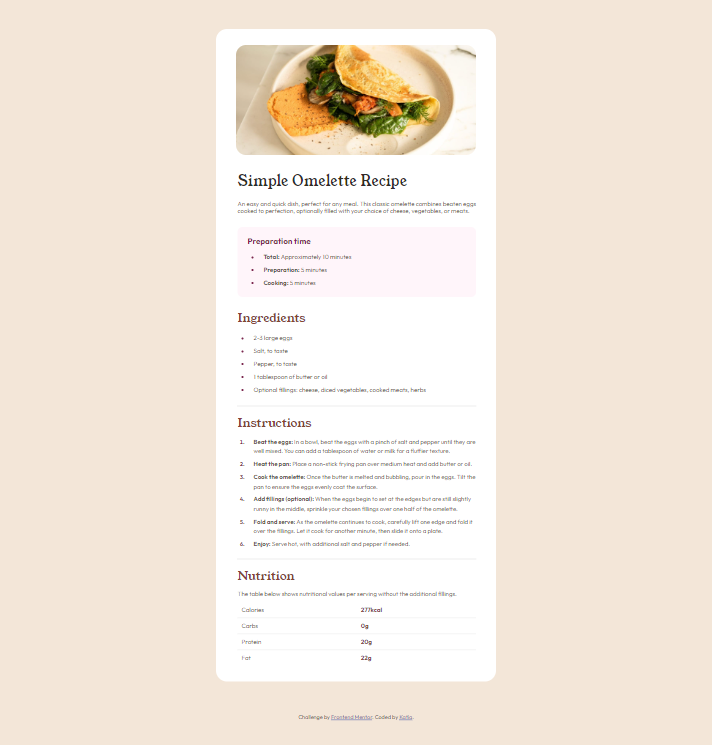
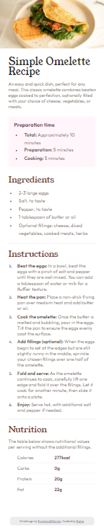

# Frontend Mentor - Recipe page solution

This is a solution to the [Recipe page challenge on Frontend Mentor](https://www.frontendmentor.io/challenges/recipe-page-KiTsR8QQKm). Frontend Mentor challenges help you improve your coding skills by building realistic projects. 

## Table of contents

- [Overview](#overview)
  - [Screenshot](#screenshot)
- [My process](#my-process)
  - [Built with](#built-with)

## Overview

This site is a simple page of a recipe. 

### Screenshot

## My process

The alignment of the attribution part and the space between the bullets and the text was the hardest for me, but thankfully after I did my research I finally overcame this project. 
I still have to keep practicing so I won´t take that long solving a problem. 

### Built with

- Semantic HTML5 markup
- CSS custom properties
- Flexbox
- CSS Grid
